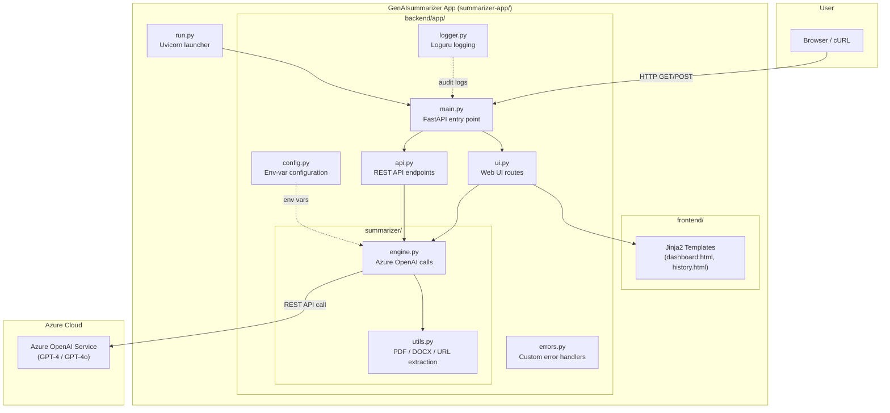

# GenAIsummarizer

A self-hosted Python web application that summarises text documents, web pages, and user input using **Azure OpenAI**. It provides both a responsive web UI and a REST API, all implemented in Python with FastAPI and Jinja2.

---

## Screenshot

> Below is the GenAIsummarizer dashboard running on `http://127.0.0.1:8000`.


*If the screenshot has not been captured yet, start the app and take a browser screenshot of the dashboard, then save it to `docs/screenshot-dashboard.png`.*

---

## Architecture Diagram



### Data Flow

1. **User** submits text, a URL, or a file via the **Web UI** or **REST API**.
2. **utils.py** extracts plain text from PDF, DOCX, or web pages.
3. **engine.py** sends the extracted text to the **Azure OpenAI** model with a system prompt for the chosen summary length (short / medium / long).
4. The model response is returned to the frontend and displayed as the summary.
5. Every action is logged by **logger.py** for audit and debugging.

---

## Features

| Feature | Description |
|---|---|
| Multi-format input | Plain text, PDF, DOCX, and web URLs |
| Configurable summary length | Short, medium, or long |
| REST API | JWT-authenticated endpoints for programmatic use |
| Web UI | Responsive, accessible Jinja2 dashboard |
| Batch processing | Summarise up to 10 files per request |
| History | Track previous summaries per user |
| Logging | Timestamped audit and error logs with Loguru |

---

## Project Structure

```
github-ai-assisted-coding/
├── startup.ps1                        # PowerShell launch script (repo root)
├── summarizer-app/
│   ├── backend/
│   │   ├── app/
│   │   │   ├── __init__.py
│   │   │   ├── main.py               # FastAPI app factory
│   │   │   ├── api.py                # REST API endpoints
│   │   │   ├── ui.py                 # Web UI routes
│   │   │   ├── config.py             # Configuration (env vars)
│   │   │   ├── logger.py             # Logging setup
│   │   │   ├── errors.py             # Custom error handling
│   │   │   └── summarizer/
│   │   │       ├── __init__.py
│   │   │       ├── engine.py         # Azure OpenAI summarisation
│   │   │       └── utils.py          # Text extraction (PDF, DOCX, URL)
│   │   └── tests/
│   │       ├── test_api.py
│   │       ├── test_summarizer.py
│   │       ├── test_auth.py
│   │       └── test_history.py
│   ├── frontend/
│   │   ├── __init__.py
│   │   └── templates/
│   │       ├── dashboard.html
│   │       └── history.html
│   ├── requirements.txt               # Python dependencies
│   ├── run.py                         # Uvicorn launcher
│   ├── startup.sh                     # Bash launch script
│   ├── .env.example                   # Environment variable template
│   └── README.md                      # App-level README
├── architecture.md
├── feature-request.md
├── requirements.md
└── .gitignore
```

---

## Prerequisites

- **Python 3.8+** (tested with 3.13)
- **Git**
- An **Azure OpenAI** resource with a deployed model (e.g., `gpt-4`, `gpt-4o`)

---

## Getting Started

### 1. Clone the repository

```bash
git clone https://github.com/Cloudlabs-Enterprises/github-ai-assisted-coding-2107591.git
cd github-ai-assisted-coding-2107591
```

### 2. Create and activate a virtual environment

**Linux / macOS (Bash)**

```bash
python3 -m venv .venv
source .venv/bin/activate
```

**Windows (PowerShell)**

```powershell
python -m venv .venv
.\.venv\Scripts\Activate.ps1
```

### 3. Install dependencies

```bash
cd summarizer-app
pip install --upgrade pip
pip install -r requirements.txt
```

### 4. Configure environment variables

Copy the template and fill in your Azure OpenAI credentials:

```bash
cp .env.example .env       # Linux/macOS
copy .env.example .env     # Windows
```

Open `.env` and set **at minimum** these three values:

```dotenv
AZURE_OPENAI_API_KEY=<your-azure-openai-api-key>
AZURE_OPENAI_ENDPOINT=https://<your-resource>.openai.azure.com/
AZURE_OPENAI_DEPLOYMENT=<your-model-deployment-name>
```

| Variable | Required | Description |
|---|---|---|
| `AZURE_OPENAI_API_KEY` | Yes | API key from the Azure portal |
| `AZURE_OPENAI_ENDPOINT` | Yes | Endpoint URL for your Azure OpenAI resource |
| `AZURE_OPENAI_DEPLOYMENT` | Yes | Model deployment name (e.g., `gpt-4`) |
| `AZURE_OPENAI_API_VERSION` | No | API version (default: `2024-02-01`) |
| `JWT_SECRET_KEY` | No | Secret for JWT signing (change in production) |
| `PORT` | No | Server port (default: `8000`) |

> **Important:** The `.env` file is git-ignored. Never commit real API keys.

### 5. Run the application

#### Option A — Direct launch

```bash
# from summarizer-app/
python run.py
```

#### Option B — PowerShell script (Windows)

From the **repository root**:

```powershell
.\startup.ps1
```

This script:
1. Activates the `.venv` virtual environment
2. Changes into `summarizer-app/`
3. Installs / updates dependencies from `requirements.txt`
4. Launches the app via `python run.py`

#### Option C — Bash script (Linux / macOS / WSL)

From `summarizer-app/`:

```bash
chmod +x startup.sh
./startup.sh
```

This script:
1. Upgrades pip
2. Installs dependencies from `requirements.txt`
3. Launches the app via `python run.py`

> **Tip:** For the bash script, make sure you activate your virtual environment first (`source ../.venv/bin/activate`), since the script does not activate it automatically.

### 6. Access the app

Once running, open your browser:

| Resource | URL |
|---|---|
| Web UI (Dashboard) | [http://127.0.0.1:8000/](http://127.0.0.1:8000/) |
| Summary History | [http://127.0.0.1:8000/history](http://127.0.0.1:8000/history) |
| Interactive API Docs | [http://127.0.0.1:8000/docs](http://127.0.0.1:8000/docs) |

---

## REST API Endpoints

| Method | Endpoint | Description |
|---|---|---|
| `POST` | `/api/token` | Obtain a JWT access token |
| `POST` | `/api/summarize/text` | Summarise plain text |
| `POST` | `/api/summarize/url` | Summarise web page content |
| `POST` | `/api/summarize/file` | Summarise an uploaded file (PDF, DOCX, TXT) |
| `POST` | `/api/summarize/batch` | Batch summarise up to 10 files |
| `GET`  | `/api/history` | Retrieve summary history |

### Example — Summarise text with cURL

```bash
curl -X POST http://127.0.0.1:8000/api/summarize/text \
  -H "Content-Type: application/json" \
  -d '{"text": "Your long document text here...", "summary_length": "short"}'
```

---

## Running Tests

```bash
cd summarizer-app
pytest backend/tests/ -v --cov=backend/app --cov-report=term-missing
```

Target: **≥ 80 % code coverage**.

---

## Troubleshooting

| Problem | Solution |
|---|---|
| `SummarizationError: Azure OpenAI is not configured` | Set `AZURE_OPENAI_API_KEY`, `AZURE_OPENAI_ENDPOINT`, and `AZURE_OPENAI_DEPLOYMENT` in `.env` |
| `ModuleNotFoundError: No module named 'uvicorn'` | Activate the virtual environment and run `pip install -r requirements.txt` |
| Connection errors from Azure OpenAI | Verify the endpoint URL and API key in the Azure portal |
| File upload errors | Ensure the file is PDF, DOCX, or TXT and under 10 MB |
| Port already in use | Set `PORT=9000` (or another free port) in `.env` |

---

## License

This project is for educational and demonstration purposes.
